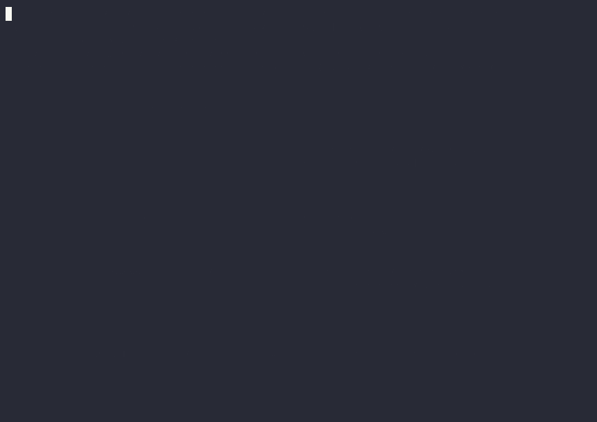

# ssh-site

Snehanshn's portfolio, served over SSH.

```sh
ssh snehanshn.duckdns.org
```

The first connection shows a host key prompt - check it against the fingerprint below before typing `yes`:

```
256 SHA256:8EHi2FeJsojjBLWhU7/p/RaXiDO+hOGgt8AFfgFEUaY (ED25519)
```

The key is generated once on the box and never regenerated by a redeploy, so this fingerprint stays valid across every update to the site.

## Watch it, or pipe it



That's the whole walkthrough for anyone who would rather not open a terminal: arrival, a drill into work, back out, into an award that drills into the project it references, then out.

Would rather skip the TUI entirely and just read the facts?
The same server answers a piped, non-interactive session with the whole portfolio as plain text and exits cleanly, so it's scriptable too:

```sh
ssh snehanshn.duckdns.org | cat
```

The recording is a checked-in asset, regenerated against the live box with [scripts/record-cast.sh](scripts/record-cast.sh) - never in CI.
See [cast/README.md](cast/README.md) for the pipeline and why it's a GIF rather than the raw `.cast`.

## Running locally

```sh
make content   # fetch the content pack into internal/content/pack/
make run       # build and start the server on localhost:2222
```

Then, from another terminal:

```sh
ssh -p 2222 localhost
```

## Getting around

The arrival screen is a banner-topped profile card: the wordmark across the top, a portrait on the left, the facts on the right, and a live nav row along the bottom.
Opening a section pushes a full-screen page onto a stack, and going back pops it.

| Key | Does |
| --- | --- |
| arrows, `tab` | move the highlight along the nav row |
| `enter` | open whatever the highlight is on |
| `esc`, `backspace` | back one level, until the card is back |
| `w` `p` `a` `l` `h` | jump straight to work, projects, awards, links or hobbies |
| up/down, pgup/pgdn, home/end, `space` | move a cursor or scroll, by page |
| `?` | the whole key list |
| `q`, `ctrl+c` | quit |

One column of every width is held back for chrome before any art is fitted, so the card wants 79 columns by 23 rows to be pixel-correct.
It shortens its rules between 72 and 78 columns, restacks vertically below that, and asks to be made bigger below 58 columns or 20 rows.
No link is ever truncated to fit: the card changes shape instead.

## Content

All facts about Snehanshn come from [github.com/SnehanshnC/content-pack](https://github.com/SnehanshnC/content-pack) at build time - nothing is hardcoded in this repo.

## Art

The portrait comes in four tiers and every visitor is served the best one their
terminal earns, decided from the environment their session arrives with:

| Tier | What it is | Who gets it |
| --- | --- | --- |
| sextant | 2x3 pixels per cell | kitty, foot, Ghostty, WezTerm - they draw the glyphs themselves, no font has them |
| quad | 2x2 pixels per cell | the mainstream default, and what `TERM=xterm-256color` gets |
| vhalf | 1x2 pixels per cell | a terminal whose colour is vouched for but whose glyphs are not |
| colorless | the hand-drawn line-art portrait, in plain ASCII | anything that does not say it can paint truecolor |

The top three are the same photograph in a Braille-dot ring, painting both a
foreground and a background in every cell so they look the same on a light
terminal as on a dark one. The bottom one is a drawing rather than that
photograph without its colour, because a photograph without colour is mush.
Nothing is guessed from the window size, and an unrecognised or absent `TERM`
degrades to the bottom rung rather than failing.

The portraits and the wordmark are build-time assets, checked in under
`internal/art/assets/` and regenerated by `make art`. CI never runs that target;
it builds from what is committed. See [art/README.md](art/README.md) for the
pipeline, its prerequisites, and why the split is where it is.

## The box

The site runs on a free-tier VM: the app server on port 22, and the admin
sshd moved to a high port so 22 is free for it.

[scripts/provision-box.sh](scripts/provision-box.sh) builds that box. It walks
the cloud console steps a human has to take, then does the machine work itself -
keys, firewall rules on both sides, and moving sshd off port 22 in an order that
proves the new port carries a session before it gives up the old one. Run it to
build the box, and run it again to rebuild one from scratch.

```sh
bash scripts/provision-box.sh
```

[scripts/deploy.sh](scripts/deploy.sh) hardens that box and puts the app on it:
nftables (a per-source-IP rate meter plus a connection cap, on both ports,
replacing the image's own iptables ruleset), the admin sshd tightened past
what the wizard already set, fail2ban scoped to the admin sshd only, and the
app server itself - a dedicated unprivileged user, a host key generated once
and backed up, and a systemd unit that restarts it on failure and on boot.
Every risky step - nftables' `policy drop`, the sshd reload - arms a dead
man's switch on the box first and only cancels it once a brand new session
proves the change didn't lock anyone out, the same pattern
`scripts/provision-box.sh` uses for the port move. It is safe to re-run:

```sh
bash scripts/deploy.sh          # everything
bash scripts/deploy.sh app      # just rebuild, upload and restart the app
```

What either script built - the IP, the admin port, where the key and the
DuckDNS token live - is recorded outside this repo. None of that is ever
committed here.

## Staying current with the content pack

[.github/workflows/pack-propagation.yml](.github/workflows/pack-propagation.yml)
polls [content-pack](https://github.com/SnehanshnC/content-pack)'s `main`
every 15 minutes. When it has moved, the workflow cross-compiles against the
new commit and runs `bash scripts/deploy.sh app` against the box - the same
call a human makes, over a separate credential scoped to exactly that: a
`ci-deploy` user whose only door to root is
[deploy/ci-deploy.sudoers](deploy/ci-deploy.sudoers), a sudo grant pinned to
one invocation of [deploy/install-app.sh](deploy/install-app.sh) and nothing
else. A leaked repo secret gets a new binary onto the box; it does not get a
shell, the admin key, or any of the box's other accounts.

`install-app.sh` snapshots whatever is live before replacing it. If the new
binary fails its restart or fails the same reachability check a visitor's own
client makes, `scripts/deploy.sh` rolls back to the snapshot automatically -
a bad pack push or a broken build never takes the site down. The box tracks
what it is currently running at `/opt/ssh-site/PACK_SHA`, world-readable, so
each poll can tell in one cheap SSH read whether there is anything to do.

Reproducing this on a rebuilt box needs nothing beyond what's already here:
`scripts/provision-box.sh` builds the VM, then any `bash scripts/deploy.sh
app` run with the personal admin key re-provisions `ci-deploy`,
`install-app.sh` and the sudoers rule from what's checked into this repo. The
GitHub side - `DEPLOY_SSH_KEY`, `DEPLOY_BOX_IP`, `DEPLOY_ADMIN_PORT`,
`DEPLOY_REMOTE_USER`, `DEPLOY_ADDRESS` - is five `gh secret set` calls away
from whatever `scripts/deploy.sh` just generated and box.env already has.

## Planning

Planning happens on a local wayfinder tracker kept out of this repo.
